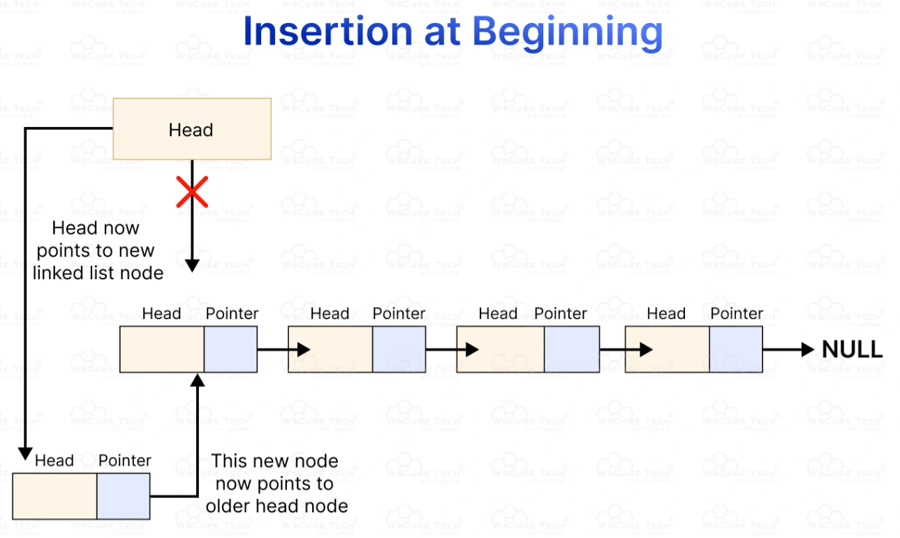

# Explicacion Listas Enlazadas

<figure><figcaption></figcaption></figure>

```
  head
    |
    v
+---------------+      +---------------+      +---------------+
|   t_list 1    |      |   t_list 2    |      |   t_list 3    |
+---------------+      +---------------+      +---------------+
| content: 0x...|--->  | content: 0x...|--->  | content: 0x...|
| next: 0x1020  |---   | next: 0x1040  |---   | next: NULL    |---|
+---------------+  |   +---------------+  |   +---------------+   |
                   |                      |                       v
                   +--------------------->+                     NULL
```

#### Puntos clave para la memoria técnica:

1. Puntero de Entrada (`head` / `*lst`): Apunta siempre al primer nodo de la secuencia. Si la lista está vacía, su valor es `NULL`.
2. Estructura del Nodo (`t_list`):
   * `content` (`void *`): Puntero al dato o información almacenada.
   * `next` (`t_list *`): Puntero a la dirección de memoria donde se encuentra alojado el siguiente nodo.
3. Fin de Lista: El último nodo contiene `next = NULL`, indicando a las funciones iterativas (como `ft_lstlast` o `ft_lstiter`) que han llegado al final.
