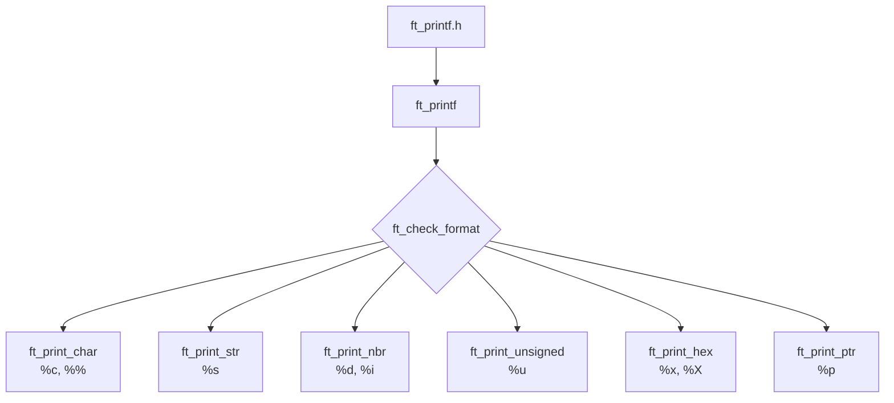

# Diagrama de flujo de ft\_printf

## Arquitectura del proyecto

La estructura de ft_printf cuenta con los siguientes archivos principales:
- ft_printf.h: El archivo de cabecera con los prototipos de las funciones, las librerías necesarias (<stdarg.h>, <unistd.h>) y la inclusión de libft (si se utiliza). 

- ft_printf.c: La función principal que recorre la cadena format y gestiona las funciones variádicas (va_start, va_arg, va_end).

- ft_check_format.c: La función distribuidora, se encarga de reconocer cada caracter especificador y llamar a las funciones "print" correspondientes. 

- Módulos de impresión auxiliaries: Funciones encargadas de procesar cada tipo de conversión especifico (%c, %s, %p, %d/%i, %u, %x/%X).
    - ft_print_char.c: Procesa un único carácter (%c) o el escape %%.

    - ft_print_str.c: Imprime cadenas completas (%s) y gestiona casos especiales como punteros a NULL.

    - ft_print_nbr.c: Gestiona la conversión e impresión de números enteros con signo (%d, %i).

    - ft_print_unsigned.c: Gestiona la conversión e impresión de números enteros sin signo (%u).

    - ft_print_hex.c: Maneja las conversiones a hexadecimal en minúsculas y mayúsculas (%x, %X).

    - ft_print_ptr.c: Maneja la impresión de direcciones de memoria de punteros (%p) agregando el prefijo 0x.




Para conectar este archivo principal con las funciones auxiliares de forma limpia y sin llenar `ft_printf.c` de muchos `if` (lo que violaría la Norma de 42 📏), la mejor estrategia es usar una función distribuidora / parseadora (por ejemplo, `ft_check_format`).

#### 🛠️ Estrategia de derivación

En lugar de poner los `if` de cada letra (`'c'`, `'s'`, `'d'`, etc.) dentro de `ft_printf`, creamos una función auxiliar que reciba el carácter especificador (`format[i]`) y la lista de argumentos `args`.

**1. La función distribuidora (`ft_check_format`)**

Usamos una estructura `switch` (o varios `if`) dentro de esta función auxiliar para derivar cada caso:

C

```
int	ft_check_format(char specifier, va_list args)
{
	int	count;

	count = 0;
	if (specifier == 'c')
		count += ft_print_char(va_arg(args, int));
	else if (specifier == 's')
		count += ft_print_str(va_arg(args, char *));
	else if (specifier == 'd' || specifier == 'i')
		count += ft_print_nbr(va_arg(args, int));
	else if (specifier == 'u')
		count += ft_print_unsigned(va_arg(args, unsigned int));
	else if (specifier == 'x' || specifier == 'X')
		count += ft_print_hex(va_arg(args, unsigned int), specifier);
	else if (specifier == 'p')
		count += ft_print_ptr(va_arg(args, void *));
	else if (specifier == '%')
		count += ft_print_char('%');
	return (count);
}
```
