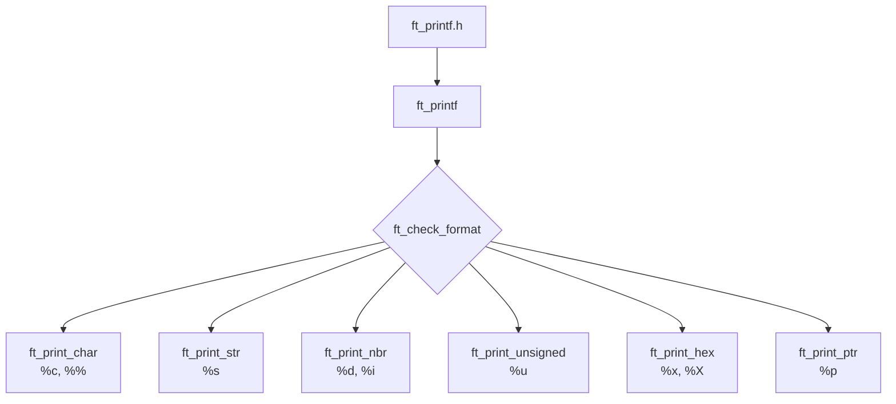

*Este proyecto ha sido creado como parte del currículo de 42 por joquinta.*

---

# ft_printf

## Descripción

El proyecto **ft_printf** consiste en la reimplementación de la famosa función `printf()` de la librería estándar de C (`libc`). 

El objetivo principal es comprender y manejar las **funciones variádicas** en C (aquellas que aceptan un número indeterminado de argumentos utilizando la librería `<stdarg.h>`), así como afianzar la gestión de formatos de conversión, punteros y bases numéricas (decimal y hexadecimal).

### Conversiones Soportadas:
- `%c`: Imprime un solo carácter.
- `%s`: Imprime una cadena de caracteres.
- `%p`: Imprime el puntero `void *` dado como argumento en formato hexadecimal.
- `%d` / `%i`: Imprime un número entero con signo en base 10.
- `%u`: Imprime un número decimal sin signo en base 10.
- `%x`: Imprime un número hexadecimal en base 16 en minúsculas.
- `%X`: Imprime un número hexadecimal en base 16 en mayúsculas.
- `%%`: Imprime un símbolo de porcentaje.

---

##  Concepto Clave: Funciones Variádicas (`<stdarg.h>`)

A diferencia de las funciones convencionales en C que requieren un número fijo de argumentos, una **función variádica** permite recibir un número variable de parámetros gracias al uso de puntos suspensivos (`...`) en su prototipo:

```
int ft_printf(const char *format, ...);
```

Para procesar estos argumentos desconocidos en tiempo de compilación, la librería `<stdarg.h>` nos proporciona las siguientes herramientas y macros:

1. **`va_list`**: Tipo de dato que funciona como un puntero/contenedor que apunta a la lista de argumentos variables.
2. **`va_start(args, format)`**: Inicializa la lista `args`. Requiere como parámetro el último argumento fijo de la función (`format`) para saber dónde empieza la secuencia de argumentos variables.
3. **`va_arg(args, tipo)`**: Extrae el siguiente argumento de la lista convirtiéndolo al `tipo` especificado y avanza automáticamente al siguiente argumento. 
*(Nota: Los tipos pequeños como `char` o `short` se promocionan automáticamente a `int` al pasarse por argumentos variádicos)*.
4. **`va_end(args)`**: Finaliza la lectura y realiza las tareas de limpieza del estado de la lista antes de salir de la función.

---

## Arquitectura del proyecto

La estructura de ft_printf cuenta con los siguientes archivos principales:
- ft_printf.h: El archivo de cabecera con los prototipos de las funciones, las librerías necesarias (<stdarg.h>, <unistd.h>) y la inclusión de libft (si se utiliza). 

- ft_printf.c: La función principal que recorre la cadena format y gestiona las funciones variádicas (va_start, va_arg, va_end).

- ft_check_format.c: La función distribuidora, se encarga de reconocer cada caracter especificador y llamar a las funciones "print" correspondientes. 

- Módulos de impresión auxiliaries: Funciones encargadas de procesar cada tipo de conversión especifico (%c, %s, %p, %d/%i, %u, %x/%X).
    - ft_print_char.c: Procesa un único carácter (%c) o el escape %%.

    - ft_print_str.c: Imprime cadenas completas (%s) y gestiona casos especiales como punteros a NULL.

    - ft_print_nbr.c: Gestiona la conversión e impresión de números enteros con signo (%d, %i).

    - ft_print_unsigned.c: Gestiona la conversión e impresión de números enteros sin signo (%u).

    - ft_print_hex.c: Maneja las conversiones a hexadecimal en minúsculas y mayúsculas (%x, %X).

    - ft_print_ptr.c: Maneja la impresión de direcciones de memoria de punteros (%p) agregando el prefijo 0x.

- Makefile: Encargado de compilar tu librería libftprintf.a. 




---

## Algoritmo y Estructura de Datos

### Estructura de Datos

No se utilizaron estructuras de datos complejas (como listas enlazadas o árboles) ni buffers dinámicos dinámicamente asignados, conforme a las restricciones del subject que prohíben la gestión de buffer del printf original.   
Se utiliza un enfoque iterativo directo apoyado en un contador acumulativo (int count) que rastrea la cantidad exacta de bytes/caracteres escritos mediante la llamada al sistema 

### Algoritmo de Procesamiento

1. Recorrido del formato: 
    Se itera caracter por caracter sobre el string format recibido.   

2. Detección de especificador:
    - Si se encuentra un caracter común, se escribe directamente en STDOUT (write(1, ...)) e incrementa el contador.
    - Si se detecta un %, se consulta el siguiente carácter para identificar la conversión solicitada (c, s, p, d, i, u, x, X, %).
3. Despacho y Conversión: Se extrae el siguiente argumento utilizando va_arg y se deriva a la función auxiliar correspondiente:   
    - Bases numéricas / Hexadecimal (%x, %X, %p): Se aplica un algoritmo recursivo de división e impresión mediante módulo (base 10 y base 16).
    - Manejo de Casos Nulos: Se comprueban punteros NULL (imprimiendo (null) para %s o (nil)/0x0 para %p según el estándar de la libc)
4. .Retorno: Retorna el valor acumulado del número total de caracteres impresos en pantalla.

---

##  Instrucciones

### Requisitos Previos e Instalación

Para compilar y probar este proyecto necesitarás un entorno Unix con `gcc` o `clang` y `make`.

### Compilación

Clona el repositorio e ingresa a la carpeta del proyecto:

git clone <url-del-repositorio>
cd ft_printf

Para generar la librería estática libftprintf.a, ejecuta:

make

Reglas Disponibles del Makefilemake 
- make all: Compila el proyecto y genera la librería libftprintf.a.
- make clean: Elimina los archivos objeto (.o).   
- make fclean: Elimina los archivos objeto y la librería libftprintf.a.   
- make re: Ejecuta fclean y vuelve a compilar todo (all).   

Compila enlazando con la librería creada:

En Terminal:

gcc -Wall -Wextra -Werror main.c libftprintf.a -o test_printf
./test_printf

---

## Recursos
### Referencias y Documentación: 
- Manual de C para printf: man 3 printf.
- Documentación oficial de <stdarg.h> y funciones variádicas en C (va_start, va_arg, va_copy, va_end).

### Uso de Inteligencia Artificial
En cumplimiento de las normas de integridad del proyecto y de la sección Recursos del Readme:   
- Tareas donde se usó IA: 
    - Explicación conceptual sobre cómo funcionan las funciones variádicas (stdarg.h), sugerencias para estructurar la arquitectura de archivos del proyecto y revisión inicial de la plantilla del archivo README.md.   
- Partes del proyecto donde se utilizó: 
    - Fase teórica previa y maquetación de la documentación. Todo el código C y la lógica de parseo/impresión han sido analizados, comprendidos e implementados directamente por el estudiante para garantizar un aprendizaje real y preparar la evaluación entre pares y exámenes.

